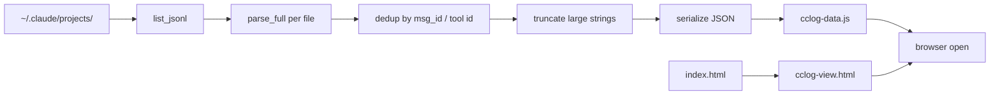

<div align="center">

# cclog-viewer

### Claude Code のセッションログをローカルで閲覧・横断検索するための単一バイナリツール

[](https://www.rust-lang.org/)
[](LICENSE)

**`~/.claude/projects/` 配下の `.jsonl` を全部読み込んで、Discord風の静的HTMLに焼き込む。サーバ不要、ブラウザだけで動く。**

---

</div>

## 概要

Claude Code は会話履歴を `~/.claude/projects/<エンコードcwd>/<sessionUUID>.jsonl` 形式で保存している。本ツールはそれらを全部スキャンしてメタ情報・メッセージを抽出し、自己完結型の HTML + JSデータファイル一式を生成する。生成された HTML をダブルクリックすればローカルで閲覧・全文検索ができる。

サーバ常駐なし。`cclog-viewer.exe` を実行するたびに最新のログから HTML を再生成して、規定のブラウザで自動オープンする。

## 特徴

| 機能 | 内容 |
| --- | --- |
| サーバレス | `~/.claude/cclog-view.html` + `cclog-data.js` を出力。`file://` で動作、Docker/Node/常駐プロセス不要 |
| 重複排除 | Claude Code の JSONL は同じ assistant メッセージを複数行に再記録するため、`message.id` / `tool_use.id` / `tool_use_id` でユニーク化 |
| 全文検索 | 全セッション横断、JSONL 中のテキスト全部対象。ヒットはセッションごとにグループ化、行番号でジャンプ |
| 折りたたみ | 検索結果のセッショングループは開閉可能。グループ多い時は自動折りたたみ |
| 統計表示 | セッションごとに USER / ASSISTANT / THINKING / TOOL / RESULT の件数、最初〜最後のタイムスタンプ、所要時間を表示 |
| 軽量描画 | 大きい `tool_result` の中身は `<details>` を開いた瞬間に DOM 生成。1000+ メッセージのセッションでも瞬時に開く |
| チャンク描画 | 150件ずつ requestAnimationFrame で順次レンダリング。連続クリックで前回の描画をキャンセル |
| サイドバー絞り込み | タイトル・初発言・cwd・ID で絞り込み |
| 日英切替 | 全UIの日本語・英語切替（localStorage に保存） |
| ライト/ダーク | テーマトグル、localStorage に保存 |
| URL permalink | `#/<sessionId>/<line>` でセッション・行を指定可、リロード/共有対応、ブラウザの戻る/進むも追従 |
| 工業系UI | 黒/グレー基調、強調は青/オレンジ、角丸なし、等幅フォント |

## インストール

### ビルド

```bash
git clone https://github.com/cUDGk/cclog-viewer.git
cd cclog-viewer
cargo build --release
```

`target/release/cclog-viewer` (Windows なら `cclog-viewer.exe`) ができる。`PATH` に置くか、ショートカットを作って好きな場所から実行できるようにする。

### 依存

- Rust 1.78 以降（実装は `serde_json` のみ依存）
- Claude Code がインストール済みで `~/.claude/projects/` に履歴がある

## 使い方

```bash
cclog-viewer
```

実行すると：

1. `~/.claude/projects/*/*.jsonl` を全部スキャン
2. メッセージをパース、重複排除、長すぎる文字列を切り詰め
3. `~/.claude/cclog-view.html` (HTML シェル, ~25KB) と `~/.claude/cclog-data.js` (データ本体, 数十MB) を出力
4. デフォルトブラウザで自動オープン

### オプション

| フラグ | 動作 |
| --- | --- |
| `--no-open` | HTML のみ生成。ブラウザで開かない |

### キーボードショートカット (ブラウザ側)

| キー | 動作 |
| --- | --- |
| `/` | 検索ボックスにフォーカス |
| `Enter` | 検索実行 |
| `Esc` | 検索クリア → 元のセッションに戻る |

### 出力ファイル

| パス | 役割 |
| --- | --- |
| `~/.claude/cclog-view.html` | UI シェル（CSS + JS）。`file://` で開く |
| `~/.claude/cclog-data.js` | 全セッションのメタとメッセージ。HTML から `<script src>` で読み込み |

両ファイルを同じディレクトリに置く必要がある。HTML だけ別の場所に移しても動かない。

## 内部の動き



| 段階 | 上限 |
| --- | --- |
| 通常テキスト (user_text / assistant_text) | 32KB |
| 思考 (thinking) | 16KB |
| ツール入力 (tool_use.input) 内の文字列 | 4KB |
| ツール結果 (tool_result.content) | 4KB |

切り詰め時は `[+N bytes truncated]` で切り捨てバイト数が表示される。完全な内容を見たい場合は元の `.jsonl` を直接見る。

## ライセンス

[MIT](LICENSE)
